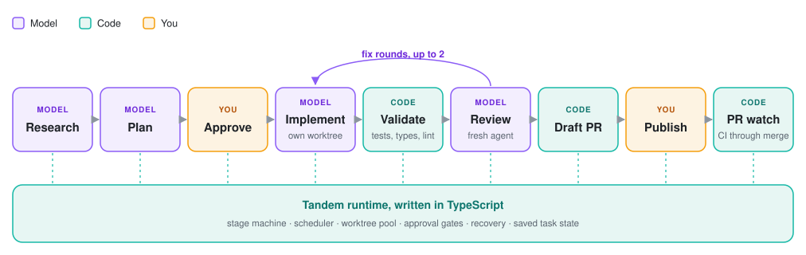
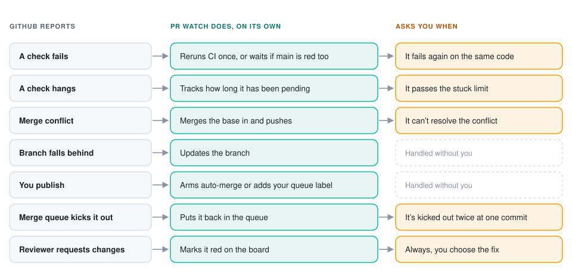
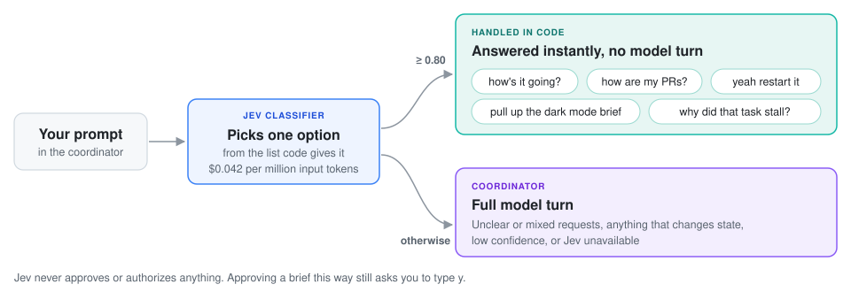
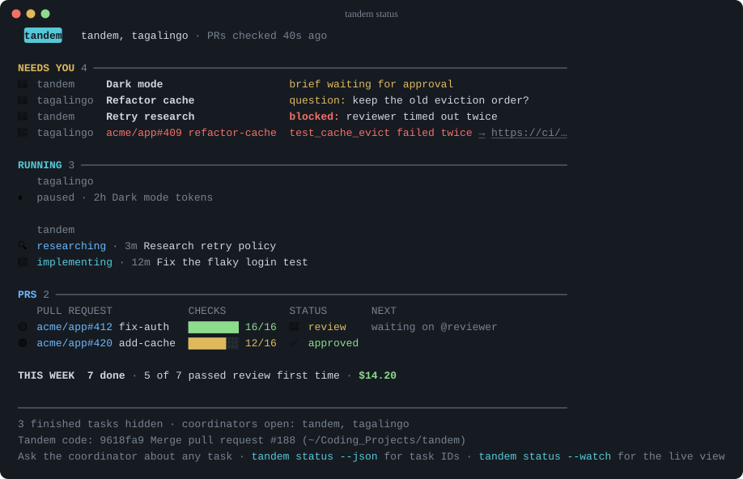

# Tandem

Tandem is an agent orchestrator and toolkit for your agents that handles the tedious parts of building with coding agents. You chat with one agent about what
you want, and Tandem takes it from idea to merged pull request: it researches the code, agrees on a
plan with you, writes the change, tests and reviews it, opens the pull request, and sees it through
CI and review. Every task is saved, so you can close the terminal and pick up where you left off.

The parts it takes off your plate:

- **Slop.** Agents pad their writing and cut corners in code. Tandem holds every agent to shared
  writing and code standards and a playbook for its kind of task, then has a fresh reviewer grade
  the work against the same rules.
- **Context windows and worktrees.** Each job gets a fresh agent with only the context it needs, in
  its own worktree that Tandem creates, reuses, and cleans up. Your own checkout is never touched.
- **Managing agents.** Tandem manages delegating research, coding, and review agents,
  which run on each on the model you picked for its role so research can use a cheaper one,
  remembers where every task stands, and brings you only the questions that need you.
- **Pull requests.** It opens them, carries them through flaky CI, conflicts, and merge queues, and
  helps you review your teammates's code with an interactive view and interface to visually understand their code and leave comments.

The orchestration behind all of this is deterministic code, and a small classifier answers routine
questions, so **model tokens go only to the work that needs judgment**.

## What it does

### Orchestration in code



Models do the judgment work: researching, planning, writing code, and reviewing it. Everything
around them is ordinary TypeScript: task stages, scheduling, worktree allocation, approvals,
validation, retries, recovery, and pull request decisions. Validation runs your project's checks
with no model involved. PR watch decides what to do from a fixed decision table.

Keeping orchestration out of the model makes Tandem **faster and cheaper, since no tokens go to
bookkeeping**, and predictable, since the same state always leads to the same next step.

### Guardrails against slop

Models tend to over-explain, pad, and reach for the same handful of phrases. Tandem holds **every
agent to a shared writing standard** that bans the usual tells (preambles, closing summaries, "not
X, it's Y", filler words like "robust" and "leverage") across chat replies, code comments, docs,
commit messages, and pull request text. Briefs have hard limits on list length and item size.

The same goes for code. Implementers write to a set of code standards (honest signatures, one level
of abstraction per function, reuse before adding, plain names, comments that explain why) and
**reviewers grade against the identical text**. A project that has its own conventions can turn these
off with `standards = "none"`.

### Playbooks

Every coding task follows a playbook for its kind of work, so **good practice happens by default on
every task**. Tandem picks the playbook, and the agent can't finish until each step is done or it
explains why one doesn't apply.

| Playbook | Main steps |
| --- | --- |
| Bug fix | Reproduce it in a failing test, fix the cause, commit the test before the fix |
| Feature | Reuse existing code, test through the public entry point, check reruns and partial failures |
| Refactor | Confirm coverage first, move every caller, delete the old version |
| Perf | Measure before and after, fix the cause |
| Fix round | Fix every finding, confirm each is gone |

### Validation and independent review

Every change runs your project's tests, types, and lint first. Then **a fresh reviewer agent that
didn't write the code** reads it through three lenses:

- **Behavior:** does it do what the approved brief says, including errors, edge cases, ordering,
  and security.
- **Design:** every changed function and its callers, graded against the same code standards and
  principles the implementer followed.
- **Coverage:** whether the changed behavior is tested, based on evidence in the diff.

Each finding has to cite evidence. Findings go back to the implementer as a fix round, and the next
review focuses on what changed since. After two fix rounds without a clean pass, Tandem stops and
asks you whether to keep going.

### Watching pull requests until they merge

A ready task opens a draft pull request with a summary, check results, and a checklist of anything
to verify by hand. From there PR watch **keeps it moving and only brings you the cases that need a
person**. Hand it any other pull request with `tandem watch <link>`.



### Picking up where you left off

Name a line of work ("wrapping up billing", "now onboarding") and Tandem keeps short notes for it:
the goal, where you left off, decisions and why, and checks to make on a date. Say "catch up on
billing" and it shows a card like `tandem status`: what's due, where you were, and the pull
requests that merged since, then suggests what to do next. "Where was I?" lists each one, and
`tandem memory billing` shows the same card in your terminal. The notes are plain Markdown in the
Tandem home, never in your repository, and nothing is kept until you name one.

### Reviewing other people's pull requests

Paste a PR link and ask for a review. Tandem checks it out in its own worktree and comes back with
what the change does, the order to read it in, the concerns that matter, and draft comments in a
teammate's voice. Edit them in conversation, then say whether to comment, approve, or request
changes. Nothing posts until you confirm. A re-review looks only at what changed since and tells
you which comments were addressed.

### Jev routing

Tandem uses [TypeSafe's Jev](docs/reference/policy.md#jev-prompt-routing), a small, fast
classifier, to handle the parts of a conversation that **don't need a full model turn**. Jev input
costs $0.042 per million tokens with output free.



- Lookups like "how's it going?", "how are my PRs?", or "list my tasks" are answered instantly.
- Short replies to Tandem's own questions ("yeah restart it") run directly. Approving a brief this
  way still asks you to type `y`.
- "Pull up the dark mode brief" and "why did that task take so long?" go straight to the right
  action.
- Each coding task's playbook is picked by Jev.

Jev only chooses among options Tandem's code lists for it. It never authorizes anything, and any
low-confidence or unclear prompt falls through to the coordinator. Without a `TYPESAFE_API_KEY`,
everything goes to the coordinator and tasks use the General playbook.

### Visual mockups

With [Lavish](https://github.com/kunchenguid/lavish-axi) installed, a research agent can draw a
mockup, wireframe, or explainer page and open it in your browser. Comment on the page and **your
comment goes straight back to the agent**, which updates the page while the tab reloads. The agent
stays open after its research, so you can settle on a design before any code is written.

### Cost control

You pick a model and thinking level for each role (planning, research, coding, review,
presentations), so research can run on a cheaper model while coding and review get stronger ones.
**Tandem never switches to a pricier model on its own.** Each request records its usage and cost, and
the coordinator's chat is compacted after a task finishes so later turns don't pay for old history.

### Everything else

- **Approvals where they matter.** Research starts on its own. Code changes wait for you to approve
  a short brief, and publishing waits for another yes.
- **Several projects and repositories.** Open multiple projects in one session. Ask for work in
  another repository and Tandem runs it there without touching your checkout, one pull request
  per repository.
- **Skills.** `/skill:tdd fix the retry bug` gives the worker and its reviewer the whole skill.
- **Self-improvement.** When a task restarts twice or gets stuck, Tandem can investigate its own
  source and propose a fix, or draft a scrubbed GitHub issue on machines that shouldn't push code.

## One view of everything

`tandem status` shows every project at once: what needs you, what's running, and your pull
requests. In Herdr you don't have to ask: a narrow panel beside each project's chat shows what
every agent is doing, and Enter on a row jumps to it. The tab bar counts what needs you
(`● 2 need you`), and when something new does, Herdr shows a notification. A few keys work from
any pane, even inside an agent:

- `prefix+t` opens the panel as a popup (Esc closes it). Closing the side panel loses nothing;
  `prefix+t` or running `tandem` brings it back.
- `prefix+0` goes back to this project's chat.
- `prefix+,` and `prefix+.` go to the previous or next project.

Herdr's sidebar starts hidden, since the panel does its job; `prefix+b` shows it.
`tandem status --watch` works in any terminal.



Sections are colored by what they mean: yellow waits on you, red failed, cyan is in progress,
green is done. Piped output and `NO_COLOR` give the same layout as plain text.

### In Tern

[Tern](https://stencil.so/tern) gives Tandem a native panel with clickable task and PR rows,
project switching, brief approval beside your chat, and PRs with CI, tours and comments under
their diff lines. Comments on Tandem's PRs go straight to the worker as fix requests. When
reviewing someone else's PR, choose the comments and verdict, then click Post to send the review.
Tern's inbox brings you questions, new draft PRs and stuck tasks.
The panel bell counts unread Tandem alerts. Click it or activate the project's inbox entry to
read them and return to the conversation; clearing Tern's inbox alone leaves this bell unchanged.
The Tern iOS app is **UNTESTED** with Tandem.

Install Tern and sign in with your Stencil account, then choose **Tern** during Tandem setup.
Tern is a closed beta, so you need access as well as an account. Setup offers it only after
confirming that it is installed and signed in; the check may briefly open its own window.
Herdr remains the default. Ask Tandem's chat to change your terminal later, after finishing or
stopping existing tasks.

Tandem asks separately before hiding Tern's sidebar and adding shortcuts for Board, PRs, Usage
and switching projects. Decline and you can still use the panel buttons and command palette.
Setup preserves custom keys; use the palette if a shortcut is already assigned elsewhere.
Choosing Herdr again restores settings Tandem changed, keeping any edits you made afterward.

- **Tasks:** click a task in the panel, follow a task link below Tandem's reply, or choose
  **Tandem: Open task…** in the command palette and search by title, id or stage. The task page
  shows its to-dos, brief, progress, diff, PR and cost. Send the worker guidance from the page,
  or restart a stuck task. Click **← Orchestrator** to return to the conversation.
- **Board:** use the panel's Board button, choose **Tandem: Toggle board** in Tern's command
  palette, or press `Cmd+Shift+B` if setup installed it. Working, Needs you, In review and
  Ready to merge lanes show each task's branch, model, cost and PR link.
- **Usage:** click the panel's limit meter, choose **Tandem: Usage**, or press `Cmd+Shift+U`
  if installed. Check provider limits and reset times first, then today's cost, agent time and
  finished tasks, weekly spend and model breakdowns.
- **Catch-up:** reopen or switch back to a previously visited project after at least an hour
  away, and Tandem shows what changed: merged PRs, what needs you, blocked tasks and your
  workstream notes. First visits and unchanged projects stay quiet. **Open what needs me**
  takes you to the first waiting item; **Dismiss** or `Esc` returns to chat.
  A project stays visible while it is selected in any Tern window.
  A catch-up failure shows a warning and leaves the project open so you can keep working.

From Board or Usage, press `Esc` or click **← Orchestrator** to return to the project's chat.
Pressing `Cmd+Shift+B` again from Board also closes it.

If a view fails before changing anything, Tern says "The Tandem view did not open and nothing
changed. Open it again." If Tandem can't tell whether a view opened, it pauses new views for that
project rather than risk a duplicate. **← Orchestrator** still takes you back to the chat, and
`tandem fix` lists the paused view so you can clear it.
[Terminal reference](docs/reference/terminal.md) covers the details.

## Requirements

- macOS
- `git`
- [Bun](https://bun.com/docs/installation)
- [Oh My Pi (OMP)](https://github.com/can1357/oh-my-pi), set up with your model provider
- [Herdr](https://herdr.dev/docs/install/) 0.8.2 or newer, or [Tern](https://stencil.so/tern),
  to hold the agent panes (Tern requires closed-beta access and a Stencil account)
- [Treehouse](https://github.com/kunchenguid/treehouse), which creates worktrees
- Optional: [`gh`](https://cli.github.com/), signed in, for pull requests and PR watch
- Optional: `lavish-axi` for presentations, `TYPESAFE_API_KEY` for Jev
- For development: [`luau`](https://luau.org) (`brew install luau`). The Tern plugin tests run the
  real Luau screens and fail without it; set `TANDEM_LUAU_BINARY` to use another path.

Agents run with your local permissions. Tandem is not a security sandbox.

## Install and first run

Clone Tandem and run its setup in one go. The `tandem` command only exists after `./setup.sh`, so
don't skip it:

```sh
git clone https://github.com/jdeocampo99/tandem.git
cd tandem
./setup.sh
```

The script installs Tandem's tools, including Herdr, and configures your saved terminal choice.
For Herdr, it updates versions older than 0.8.2 and offers the panel, keys, tab-bar summary and
notifications, showing the changes before asking. Install Tern separately and choose it during
first-run setup to get its native views; Tandem asks separately about Tern's global sidebar and
shortcuts. Read [setup.sh](setup.sh) first if you want to check; it is safe to run again. Keep
Bun's global bin directory on your `PATH`.

Then, from any folder:

```sh
tandem
```

The first run opens Tandem's own chat with a welcome popup. With Lavish installed, Tandem opens a
one-page setup in your browser. It has four steps:

1. **Models** — choose a model and thinking level for each job from the OMP catalogue, and
   choose Herdr or Tern when Tern is ready.
2. **Repos** — choose discovered checkouts, scan another code folder, or add a checkout by its exact
   path. Review and edit the validation and install commands for each.
3. **Self-improvement** — choose whether Tandem should investigate its own recurring problems and
   offer a fix or draft an issue.
4. **Review** — check the complete answer, including which selected providers Tandem may spend on.

Save and continue is your one consent to apply the models and selected providers, code folders,
self-improvement and terminal choices, and selected repository settings, then open a chat for each selected repo.
Tandem validates the answer against the current machine before it saves anything; the coordinator
posts a fixed success or error status in chat. The page only reports that the request was submitted
and saving is in progress until that status arrives. Chat-based setup keeps its own approval step.
You do not choose MCP servers or a worker-skill set in onboarding:
coordinators and child workers use the skills and MCP servers OMP loads for their checkout and user
configuration. OMP's own configuration still controls what is available; Tandem does not grant
every skill or server that might exist elsewhere.
Without Lavish, the chat walks through the same four decisions. It checks your tools, helps you pick
models, asks where you keep code and which repos to set up, then shows the checks and install step
it found for each repo for you to confirm or change. It asks before saving settings and opening the
project's own chat. Leave halfway and it picks up where you stopped. Ask it to change how Tandem
works, too; it tries settings first and makes code changes as ordinary tasks. After that, plain
`tandem` from any folder reopens Tandem's chat and every saved project with its previous chat.
`tandem /path/to/repo` still works.

The Repos step lists checkouts Tandem found before you type; click one to add it. If yours isn't
listed, **Choose another folder…** opens the macOS folder picker and scans the folder read-only. If
the picker is unavailable, enter a folder path (such as `~/code`) instead. The page refreshes with
matches and restores the draft choices; keep the page open while the search result arrives. You can
also add a checkout by its exact path when scanning did not find it. Search requests do not save
folders or settings: roots are saved alongside existing ones only after you choose Save and continue
on the Review stage.
Ask for help in Lavish's Conversation panel and Tandem answers there without making you save first.

## Commands

| Command | What it does |
| --- | --- |
| `tandem [PATH ...]` | Open Tandem's chat and your projects, resuming their chats |
| `tandem status [TASK_ID]` | What needs you, what's running, and your pull requests; with a task ID, that task's history |
| `tandem trace [TASK_ID]` | What happened to a task and why, with review, fix-round, blocked-time, and cost figures |
| `tandem report` | A page in Lavish showing where each task's time and money went and what held it up (`--since DATE` to narrow it) |
| `tandem watch [PR]` | Your watched pull requests; with a link or number, start watching it (`--stop` to stop) |
| `tandem memory [NAME]` | This project's workstreams; with a name, its catch-up and where its notes file is |
| `tandem update` | Load your latest local Tandem code into every coordinator, keeping chats and tasks |
| `tandem fix` | Clean up leftovers from a crash or failed launch, including paused Tern views and panes Tandem stopped touching (asks first) |
| `tandem configure [PATH]` | Change models and project settings |
| `tandem config [PATH]` | Open the project's settings file |
| `tandem welcome` | Show the welcome message again |
| `tandem reset` | Cancel all in-progress tasks and reopen fresh coordinators |
| `tandem reset --hard` | Delete all Tandem state and start over |

Run `tandem --help` for options.

## When something goes wrong

Start with `tandem status`, then `tandem trace TASK_ID` to see why a task stalled. Ask the
coordinator to restart a stuck task; it keeps its worktree and history. `tandem update` replaces a
misbehaving coordinator without cancelling work, and `tandem fix` cleans up after a crash. Don't
delete Tandem's files, panes, or worktrees by hand.

Tandem keeps its data in `~/.tandem`, never in your repository.

## Credits

Tandem's playbooks and the principles its coding and review agents follow are adapted from
[pstack](https://github.com/cursor/plugins/tree/main/pstack) (MIT). Worktrees come from
[Treehouse](https://github.com/kunchenguid/treehouse) and visual mockups from
[Lavish](https://github.com/kunchenguid/lavish-axi), both by Kun Chen.

## Learn more

- [Reference](docs/reference/): the behavior behind every command, setting, and safety check.
- [AGENTS.md](AGENTS.md): contributing to Tandem.
- [Skills](skills/README.md): let any agent session explain Tandem, onboard a repository, or
  report status.
